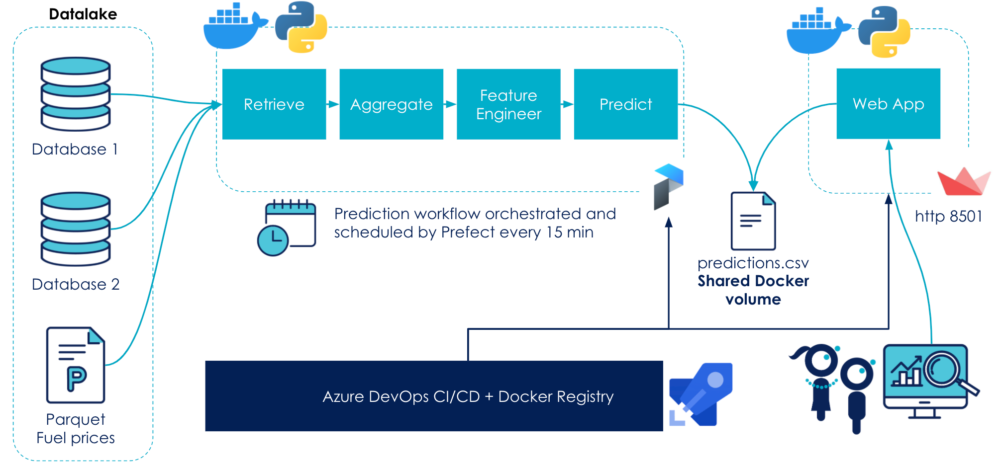
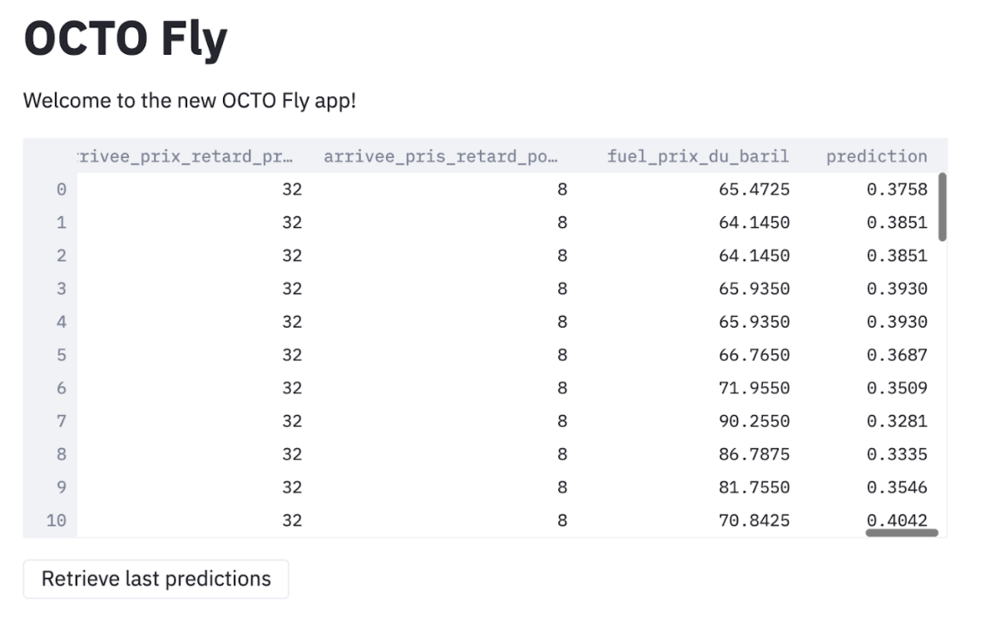

# OCTO Fly

This project was created as a solution to the final evaluation of OCTO Academy's [AI Certification](https://www.octo.academy/fr/parcours-formations/2-intelligence-artificielle-par-la-pratique-des-fondamentaux-a-l-industrialisation) 
(_"Développement et conduite de projets d'intelligence artificielle"_).

During the final evaluation, the candidate is given access to several raw files and SQLite DBs and asked to create a 
data science solution that can predict flights' delays based on historical data from several airports. We expect the 
candidate not to focus on creating a performing ML model (the data is fake and doesn't contain signal), but rather 
to propose an elegant end-to-end solution that could be deployed in production.

_**Disclaimer**: As no additional data source was provided for the prediction part, the current prediction workflow simulates
the existence of such data by predicting flight delays every 15min based on a random batch of 50 examples extracted from
the training data. Of course, it wouldn't be the case in a real-world project!_

## Proposed architecture



## Project structure

The project structure served as an inspiration to the [cookiecutter data science industrialization project template](https://github.com/Caffeinside/cookiecutter-data-science-indus) 
also available on my GitHub.

## Local quickstart

Create your local environment and install the project's dependencies (in dev mode):
```bash
conda create --name octo_fly python==3.7
conda activate octo_fly
pip install -e .
```

Train (or retrain) the model - this can take a few minutes:
```bash
python pipeline/train.py
```

Launch the [Streamlit](https://www.streamlit.io/) app and the orchestrated batch prediction service:
```bash
docker-compose -f docker/docker-compose-dev.yml up
```

**Et voilà!** You can check the web app at http://localhost:8501. 
The results will be updated every 15min with the last predictions.

